# Enterprise Service Desk Platform: Production-Ready osTicket Deployment

A production-style help desk ticketing system built with **osTicket** for a fictional company, **Fly MSSP**.  
This project demonstrates the deployment, configuration, operation, and monitoring of an IT support ticketing platform in a local virtualized Linux environment.

---

## System Architecture

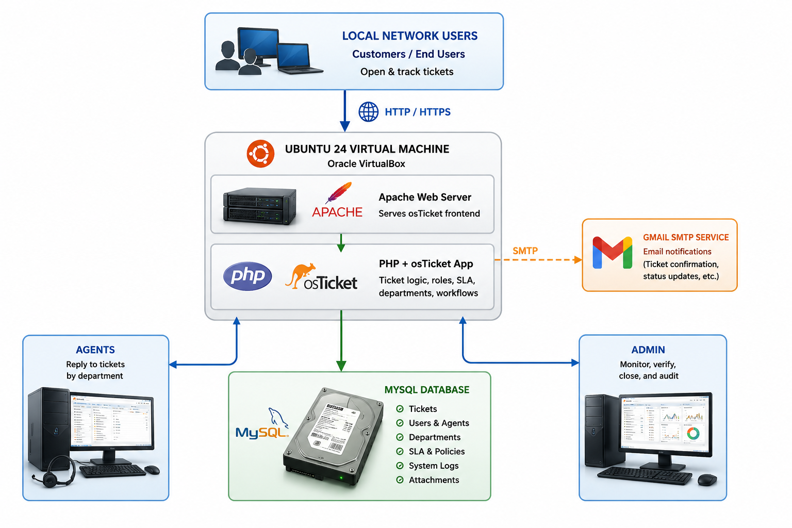

--- 

## Project Overview

This repository documents the setup of an enterprise service desk platform using osTicket. The goal of the project was to simulate a real IT support environment where users can open tickets, agents can investigate and respond, and administrators can monitor, verify, and close resolved issues.

The project includes server setup, database configuration, osTicket installation, department and agent configuration, SLA creation, SMTP email setup, ticket lifecycle simulation, and system log analysis.

---

## Key Features Implemented

- Deployed osTicket on an Ubuntu virtual machine
- Configured Apache, MySQL, PHP, and required PHP extensions
- Created a dedicated MySQL database and database user for osTicket
- Set up an admin account and customized helpdesk identity
- Created departments for structured ticket routing
- Created agents and assigned them to departments
- Created help topics to categorize user issues
- Set up SLAs with different response times based on priority
- Integrated Gmail SMTP for email notifications
- Opened test tickets through multiple simulated customers
- Responded to tickets through agent accounts
- Verified and closed resolved tickets through the admin account
- Monitored ticket activity through the osTicket dashboard
- Reviewed warning logs such as failed login attempts and invalid CSRF token alerts

---

## Technologies Used

- Ubuntu 24.04
- Oracle VirtualBox
- Apache Web Server
- MySQL
- PHP
- PHP Extensions
- osTicket
- Gmail SMTP
- Local Area Network Deployment

---

## Deployment Walkthrough

The following sections document the complete deployment, configuration, operation, and monitoring workflow of the osTicket environment.

## Step 1: Setup

### Setup Apache Web Server

Set up Apache on Ubuntu 24 to host the osTicket application locally.

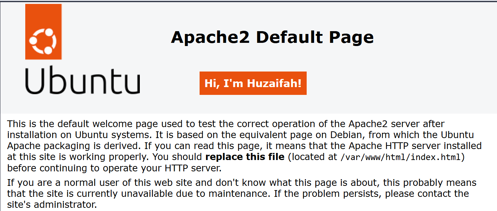

 

### MySQL Database Configuration

Created a dedicated MySQL database and user for osTicket deployment.

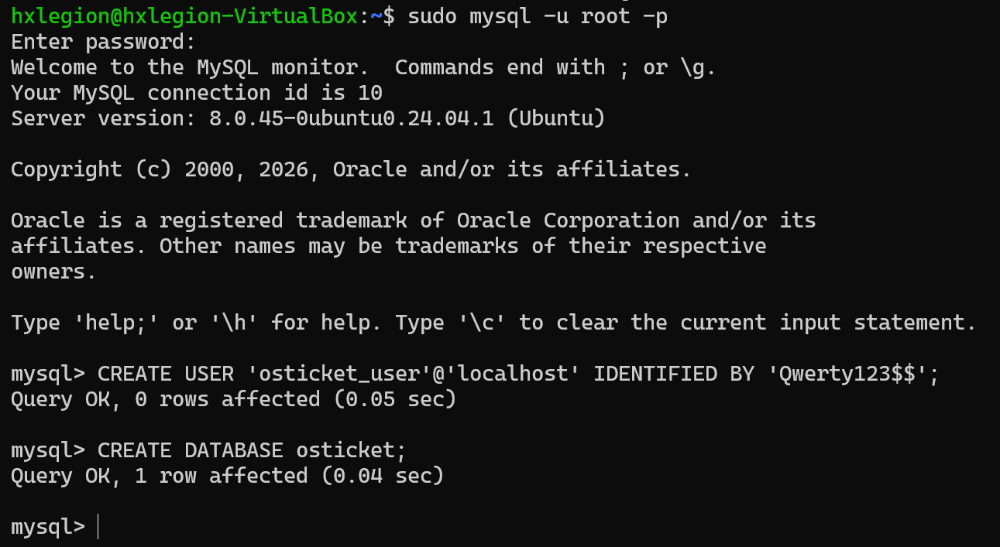

 

### osTicket Initial Configuration

Assigned the administrator account, helpdesk name, and support email.

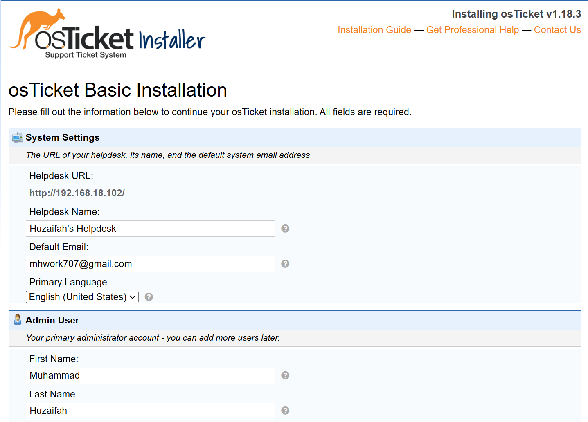

 

### Customer Support Center

Verified successful deployment through the customer support portal.

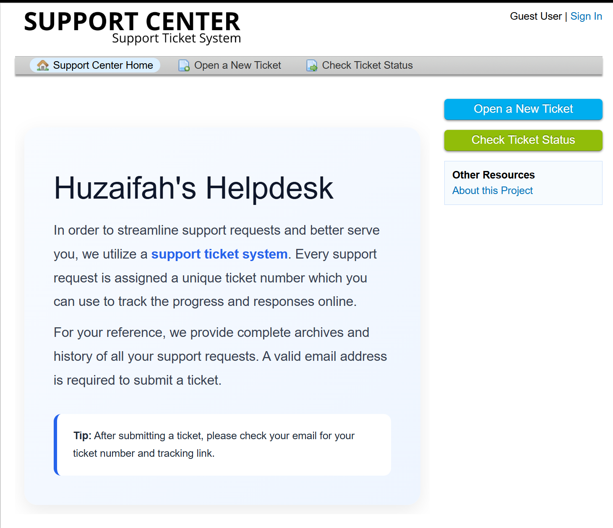

---

## Step 2: Configuration of osTicket

### Configure Service Level Agreements (SLAs)

Established four SLA levels with different response times according to ticket priority.

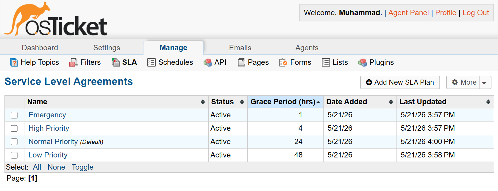

 

### Configure Login Lockout Policy

Configured failed login lockout policies to improve authentication security.

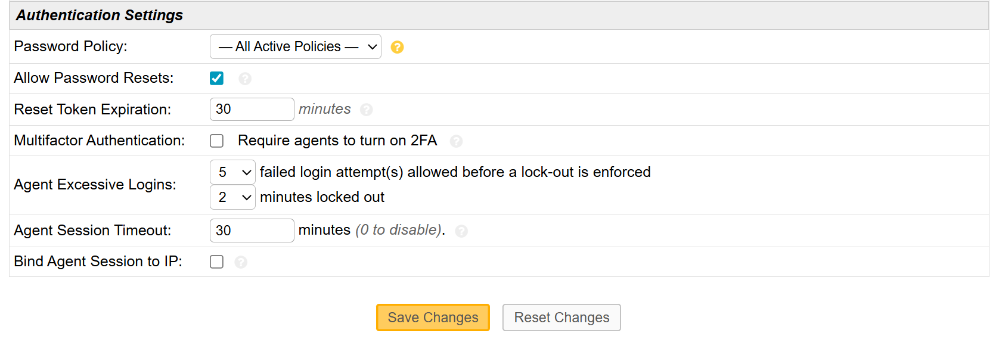

 

### Create Departments

Created support departments according to organizational responsibilities.

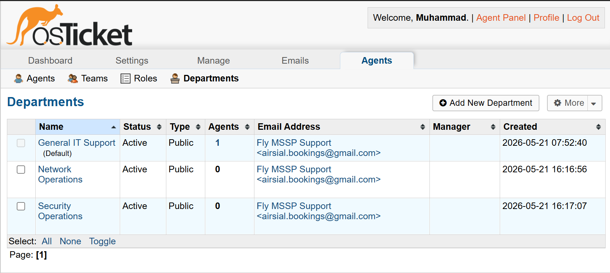

 

### Create Agents

Created agents and assigned them to their respective departments.

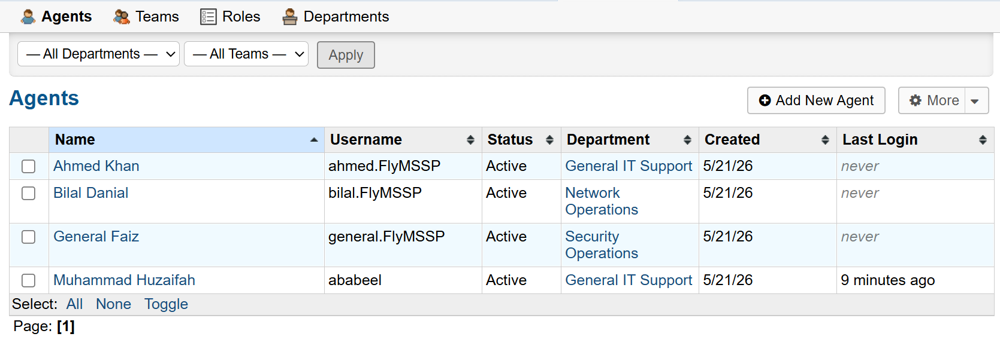

 

### Configure Help Topics

Implemented help topics to automatically route tickets to the correct departments.

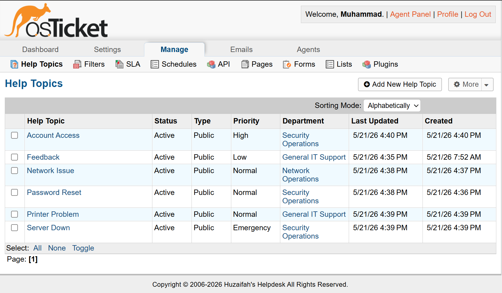

---

## Step 3: Opening and Closing Tickets

### Open Support Tickets

Created multiple tickets using different customer accounts to simulate common IT support issues.

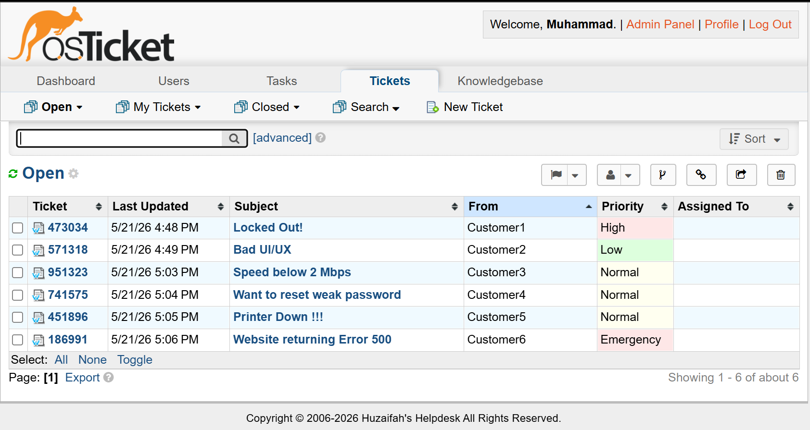

 

### Submit Ticket Attachments

Users submitted tickets with descriptions and file attachments through the support portal.

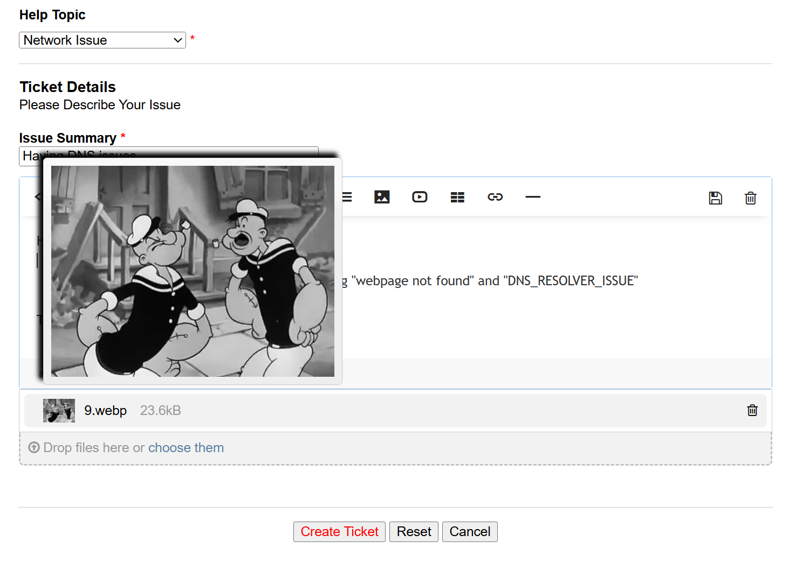

 

### Automatic Email Notifications

Integrated Gmail SMTP so customers automatically receive ticket confirmation emails and tracking details.

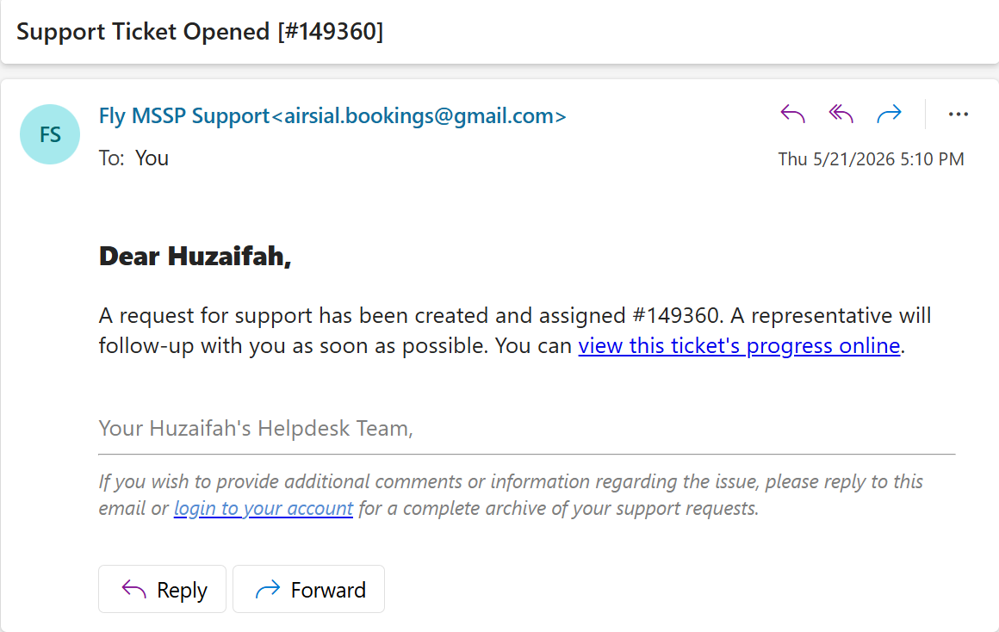

 

### Agent Ticket Responses

Agents reviewed and responded to tickets assigned to their departments.

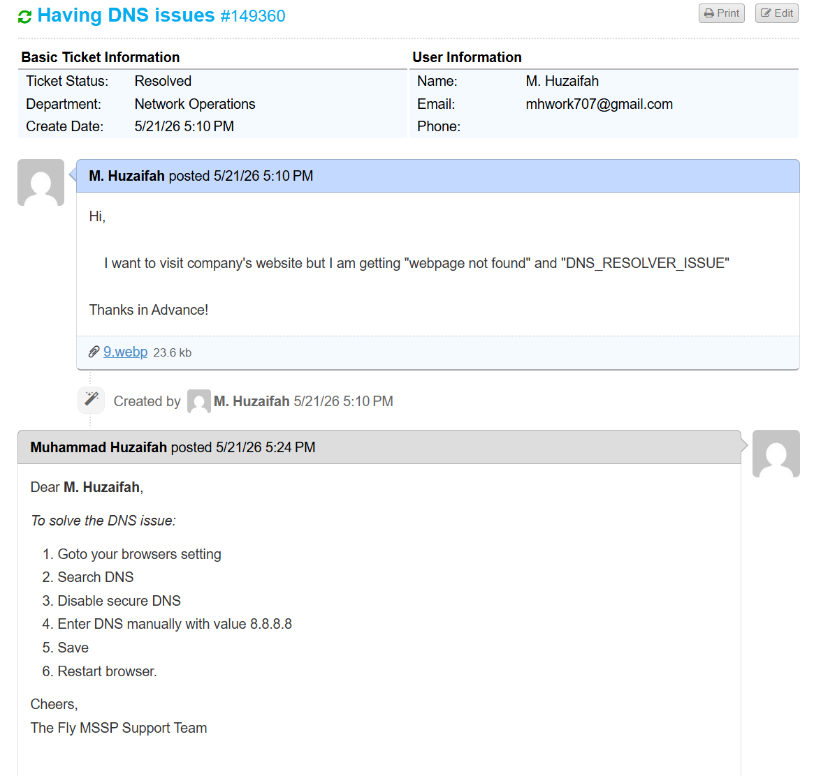

 

### Admin Ticket Management

The administrator monitored ticket progress and closed tickets after verifying issue resolution.

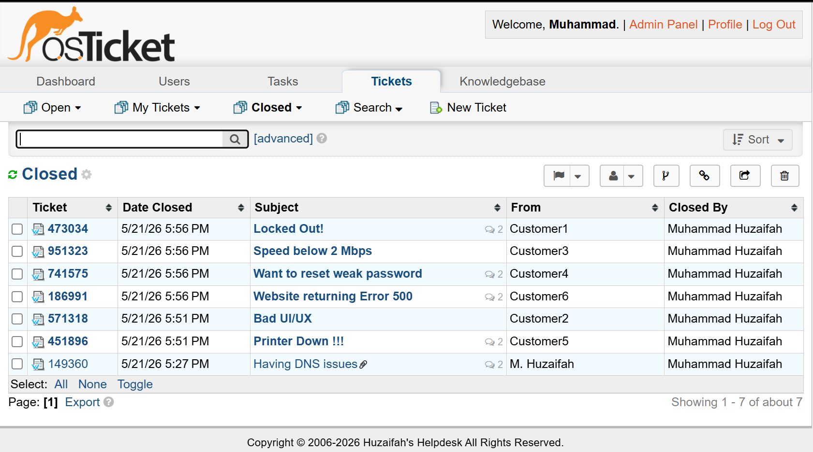

---

## Step 4: Monitoring and Triaging Alerts

### System Warning Logs

Reviewed warning logs generated during simulated security and operational events.

Warnings included:
- Failed login attempts
- Invalid CSRF token alerts caused by disabled browser cookies

Analyzed timestamps and IP addresses associated with alerts to determine whether events represented genuine threats or false positives.

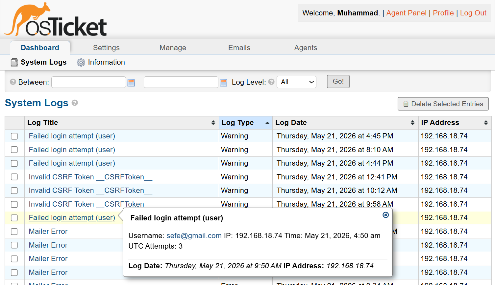

 

## Admin Dashboard

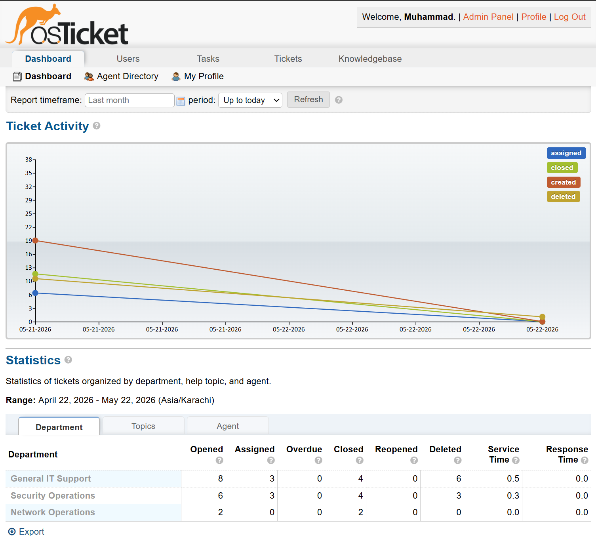

---

## Skills Demonstrated

- Linux server administration
- LAMP stack deployment
- Web application deployment
- MySQL database setup
- PHP extension troubleshooting
- osTicket configuration
- SMTP email integration
- Ticket queue management
- SLA design
- Role-based access control
- System log analysis
- IT support workflow simulation
- Incident triage and resolution tracking

---

## Disclaimer

This environment is isolated and non-production. The project is intended for educational and demonstration purposes, and no real organizational data is used.
